# Service Mesh workshop disconnected environment Guide

Service Mesh workshop 主要练习如何使用 OpenShift Service Mesh 实现对不同代码栈的微服务的监控, 调用链追踪, 灰度发布, 故障注入, 安全等功能.  
共有 4 个应用, 其中, app-ui 是聚合门户, boards/context-scraper/userprofile 服务分别提供对应的内容; app-uiboards/context-scraper 由 node.js 实现; userprofile 用 java 实现, 共有 3 个版本, 用来练习新版本发布/回退, 故障分析, 调整灰度比例等.  

离线 Service Mesh workshop 与在线环境的差异在于不能连接互联网.  应用无法通过 build config 从 git 仓库下载 code 并构建为镜像, 或者必须离线的 git 仓库, 提供 base image 的镜像仓库, 以及提供应用依赖的 npm 包和 jar 包的 nexus 仓库.  
例如, boards, context-scraper, app-ui 需要 openshift 项目中有效的 nodejs:16-el8 的 image stream; userprofile 需要 openshift 项目中有效的 java:11 的 image stream.  

变通的方法是将构建好的应用镜像导入离线环境的镜像仓库供练习使用, 并从练习的部署文件中删除 build config 部分.  


## 离线 Operators 下载和安装

离线 OpenShift v4.10, 离线镜像仓库, Service Mesh Operator 及其依赖的 Operators.  
离线 OperatorHub 的配置 和 离线 Operators 下载和安装, 请参考: [OpenShift官方文档](https://docs.openshift.com/container-platform/4.10/operators/admin/olm-restricted-networks.html)  
注, operator 安装需要管理员权限.  

关于 OpenShift 容器平台和其上的 Operators 的技术问题, 请咨询 Red Hat 协助支持  

1. 在 OpenShift 中建立 2 个项目, user1 和 user1-istio, 其中 user1-istio 将部署 Service Mesh Control Plane; user1 将部署应用.  
```
oc new-project user1
oc new-project user1-istio
```
注, 若网络隔离, 需要允许 user1-istio 和 user1 项目能相互访问  


2. 安装 Service Mesh Operator  
请参考:[Service Mesh Operator官方文档](https://docs.openshift.com/container-platform/4.10/service_mesh/v2x/installing-ossm.html)
在 OpenShift 控制台页面操作, 完成 Operators 的安装. 然后用 oc 工具验证  
```
oc get pod -n openshift-operators
NAME                                    READY   STATUS    RESTARTS   AGE
istio-operator-8497fc956d-rcgfb         1/1     Running   0          2m53s
kiali-operator-ddbcf899d-qzq6v          1/1     Running   0          5h15m
```

3. 安装 RHSSO Operator  
请参考:[RHSSO Operator官方文档](https://access.redhat.com/documentation/en-us/red_hat_single_sign-on/7.6/html/server_installation_and_configuration_guide/operator#doc-wrapper)
在 OpenShift 控制台页面操作, 完成 Operators 的安装. 然后用 oc 工具验证  
```
oc get pod -n user1
NAME                                    READY   STATUS    RESTARTS   AGE
rhsso-operator-5797798649-5qglq   1/1     Running     0              24h
```


4. 里程碑  
Service Mesh Operator 在 openshift-operators 项目安装成功; RHSSO Operator 在 user1 项目安装成功.  


## 准备离线 Service Mesh workshop 实验

1. 部署 Service Mesh Control Plane 到 user1-istio 项目.  
在 OpenShift 控制台, 使用 Service Mesh operator 管理页面的 Istio Service Mesh Control Plane 标签页 创建  
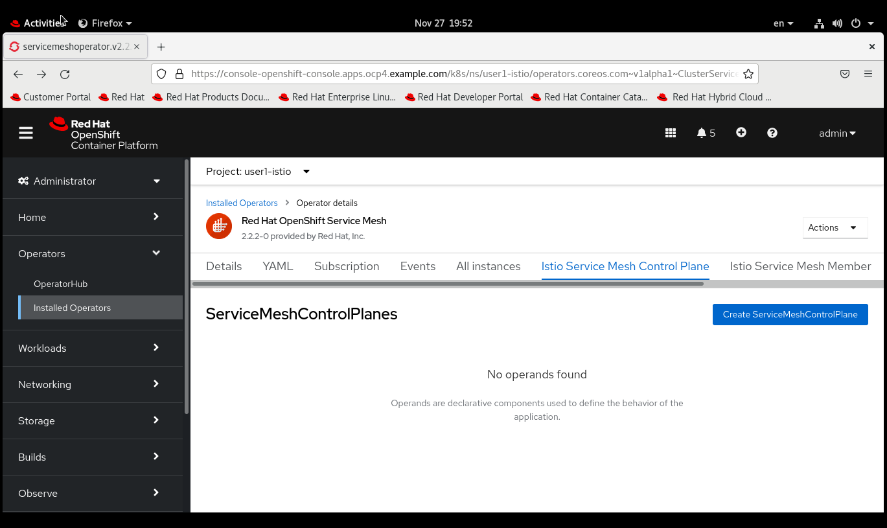  

使用 default 模板创建  
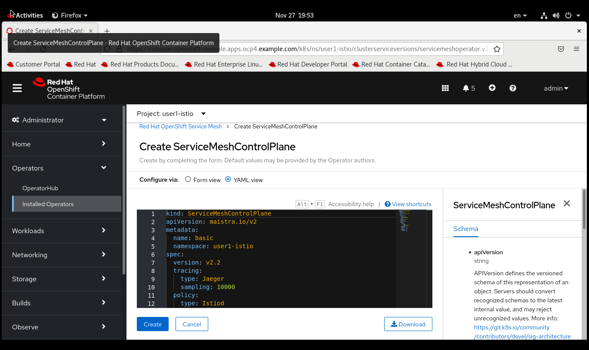  

创建完成  
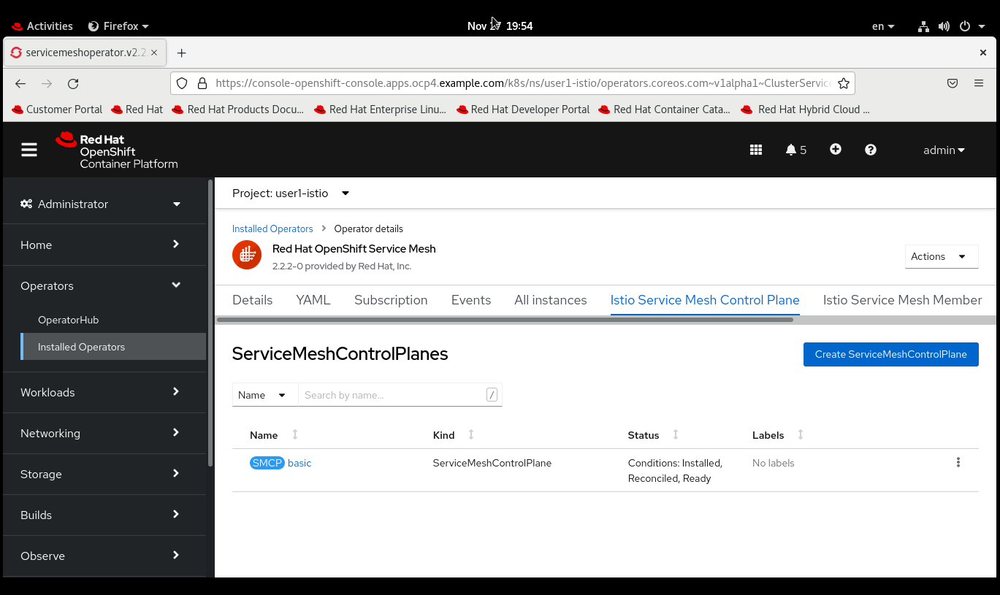  

使用 oc 命令行工具查看  
```
oc get pod -n user1-istio
NAME                                    READY   STATUS    RESTARTS   AGE
grafana-7c57f84485-hfzkv                2/2     Running   0          4m6s
istio-egressgateway-76b4bdf9c4-pq2x7    1/1     Running   0          4m8s
istio-ingressgateway-5df756657c-bwnxt   1/1     Running   0          4m9s
istiod-basic-7d7f88d5c7-vm4jh           1/1     Running   0          4m20s
jaeger-69569ff6c8-zlvz8                 2/2     Running   0          4m6s
kiali-6f574b74bc-w2x5m                  1/1     Running   0          112s
prometheus-8d759dbb9-884n8              2/2     Running   0          4m15s

oc get smcp -n user1-istio
NAME    READY   STATUS            PROFILES      VERSION   AGE
basic   9/9     ComponentsReady   ["default"]   2.3.0     5m4s
```

2. 添加 user1 项目为 Service Mesh Member Roll.  
在 OpenShift 控制台, 使用 Service Mesh operator 管理页面的 Istio Service Mesh Member Roll 标签页 创建  
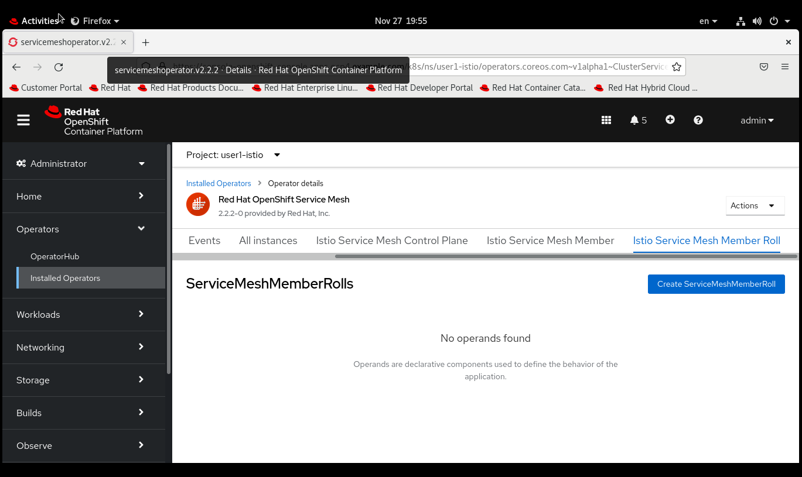  

使用 default 模板创建  
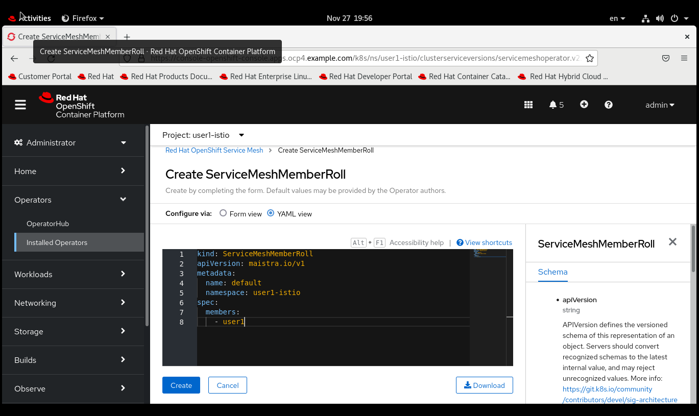  

更改 members 为 user1 项目  
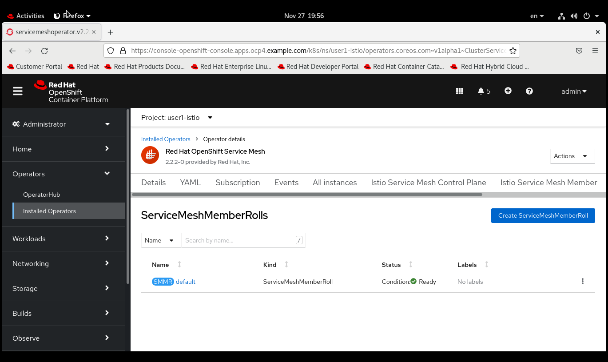  

使用 oc 命令行工具查看  
```
oc get smmr -n user1-istio -o wide
NAME      READY   STATUS       AGE   MEMBERS
default   1/1     Configured   13m   ["user1"]
```


3. 导入示例应用以及依赖的镜像, 并推送到离线镜像仓库  
```
podman pull quay.io/lshu_cn/app-ui:latest
podman pull quay.io/lshu_cn/boards:latest
podman pull quay.io/lshu_cn/context-scraper:latest
podman pull quay.io/lshu_cn/userprofile:1.0
podman pull quay.io/lshu_cn/userprofile:2.0
podman pull quay.io/lshu_cn/userprofile:3.0
podman pull registry.redhat.io/rhscl/mongodb-36-rhel7:1
podman pull registry.redhat.io/rhel8/postgresql-12:1

podman tag quay.io/lshu_cn/app-ui:latest <app-ui img url>
podman tag quay.io/lshu_cn/boards:latest <boards img url>
podman tag quay.io/lshu_cn/context-scraper:latest <context-scraper img url>
podman tag quay.io/lshu_cn/userprofile:1.0 <userprofile:1.0 img url>
podman tag quay.io/lshu_cn/userprofile:2.0 <userprofile:2.0 img url>
podman tag quay.io/lshu_cn/userprofile:3.0 <userprofile:3.0 img url>
podman tag registry.redhat.io/rhscl/mongodb-36-rhel7:1 <mongodb-rhel7:3.6 img url>
podman tag registry.redhat.io/rhel8/postgresql-12:1 <postgresql:12 img url>

podman login -u <username> <local registry url>

podman push <app-ui img url>
podman push <boards img url>
podman push <context-scraper img url>
podman push <userprofile:1.0 img url>
podman push <userprofile:2.0 img url>
podman push <userprofile:3.0 img url>
podman push <mongodb-rhel7:3.6 img url> --remove-signatures
podman push <postgresql:12 img url> --remove-signatures
```
注: registry.redhat.io 上的镜像签名是多cpu架构镜像, 下载只是 amd64 的版本导致签名不匹配, 推送时要删除  


4. 导入应用镜像到 user1 项目.  
使用 oc 命令行工具导入, 生成 image stream  
```
oc import-image app-ui --from=<app-ui img url> --confirm
oc import-image boards --from=<boards img url> --confirm
oc import-image context-scraper --from=<context-scraper img url> --confirm
oc import-image userprofile --from=<userprofile img url> --all --confirm
oc import-image mongodb:3.6 --from=<mongodb-rhel7:3.6 img url> --confirm
oc import-image postgresql:12 --from=<postgresql:12 img url> --confirm

oc get is -n user1
NAME              IMAGE REPOSITORY   TAGS          UPDATED
app-ui                               latest        45 hours ago
boards                               latest        45 hours ago
context-scraper                      latest        45 hours ago
mongodb                              3.6           4 hours ago
postgresql                           12            8 seconds ago
userprofile                          1.0,2.0,3.0   45 hours ago
```
注: mongodb 的 istag 为 3.6, 与下面的默认参数对应  


5. 下载离线 Service Mesh workshop code  
使用 git 同步离线 Service Mesh workshop code 目录  
```
git clone https://github.com/lees07/sm-workshop-code-disconnected.git
```


6. 里程碑  
Service Mesh Control Plane, Service Mesh Member Roll 配置完成; 应用镜像导入完成; 代码下载完成.  


## workshop 操作指导

参考: [Service Mesh workshop guide](https://github.com/RedHatGov/service-mesh-workshop-dashboard/tree/main/workshop/content)  

由于离线环境, lab5.3 ~ 5.5 无法实现, 请忽略.  
请在 sm-workshop-code-disconnected 目录进行实验...  


### lab1.3 部署微服务
使用 oc 工具在 user1 项目中操作...  
在部署中增加注释 'sidecar.istio.io/inject: "true"', Service Mesh 将自动注入
```
pwd
<dir>/sm-workshop-code-disconnected

oc project user1

oc project
Using project "user1" on server "https://<api server url>:6443".
```

1. 部署 boards 应用  
查看 boards-fromsource.yaml 模板文件, 注意参数的默认值, 以及与 is 和 istag 的对应  
```
oc new-app -f ./config/app/boards-fromsource.yaml \
  -p APPLICATION_NAME=boards \
  -p DATABASE_SERVICE_NAME=boards-mongodb \
  -p MONGODB_DATABASE=boardsDevelopment \
  -p STORAGE_CLASS=<your storage class>
```

2. 部署 context-scraper 应用  
查看 context-scraper-fromsource.yaml 模板文件, 注意参数的默认值, 以及与 is 和 istag 的对应  
```
oc new-app -f ./config/app/context-scraper-fromsource.yaml \
  -p APPLICATION_NAME=context-scraper
```

3. 部署 app-ui 应用  
查看 app-ui-fromsource.yaml 模板文件, 注意参数的默认值, 以及与 is 和 istag 的对应  
```
oc new-app -f ./config/app/app-ui-fromsource.yaml \
  -p APPLICATION_NAME=app-ui \
  -p FAKE_USER="true"
```
注, 使用模拟的帐号信息  


4. 查看 pod  
由于 service mesh 注入, 应用部署后有两个容器  
```
oc get pod
NAME                              READY   STATUS      RESTARTS      AGE
app-ui-1-deploy                   0/1     Completed   0              13m
app-ui-1-jqzb5                    2/2     Running     0              13m
boards-1-deploy                   0/1     Completed   0              179m
boards-1-g498n                    2/2     Running     1 (178m ago)   179m
boards-mongodb-1-deploy           0/1     Completed   0              179m
boards-mongodb-1-jw445            2/2     Running     0              179m
context-scraper-1-5z964           2/2     Running     0              167m
context-scraper-1-deploy          0/1     Completed   0              167m
rhsso-operator-5797798649-5qglq   1/1     Running     0              24h

oc get pods -l app=app-ui -o jsonpath='{.items[*].spec.containers[*].name}{"\n"}'
app-ui istio-proxy
```


5. 访问应用  
创建 service mesh 的 gateway 规则和 virtual service 规则  
```
oc create -f ./config/istio/gateway.yaml
gateway.networking.istio.io/ingressgateway created
virtualservice.networking.istio.io/ingressgateway created

GATEWAY_URL=$(oc get route istio-ingressgateway -n user1-istio --template='http://{{.spec.host}}')
echo $GATEWAY_URL
http://istio-ingressgateway-user1-istio.apps.<your domain url>
```

然后通过浏览器访问应用. 在 Shared 标签页添加几条信息. 此时的应用在 profile 标签页显示 unknown 用户信息.  


### lab2.2 部署 userprofile v1 服务
替换 ./config/app/userprofile-deploy-all.yaml 文件中 %USER_PROFILE_IMAGE_URI% 和 %STORAGE_CLASS%  
部署 userprofile 1.0 版本的应用  
```
USER_PROFILE_IMAGE_URI=<userprofile img url>
echo $USER_PROFILE_IMAGE_URI
e.g. "registry.ocp4.example.com:5000/sm-workshop/userprofile"

STORAGE_CLASS=<ocp cluster storage class name>
echo $STORAGE_CLASS
e.g. gp2

sed "s|%USER_PROFILE_IMAGE_URI%|$USER_PROFILE_IMAGE_URI|" ./config/app/userprofile-deploy-all.yaml > ./config/app/userprofile-deploy-v1.yaml
sed -i "s|%STORAGE_CLASS%|$STORAGE_CLASS|g" ./config/app/userprofile-deploy-v1.yaml

oc create -f ./config/app/userprofile-deploy-v1.yaml

oc get pods -l deploymentconfig=userprofile
NAME                           READY   STATUS    RESTARTS   AGE
userprofile-5f57dcfccd-spsh7   2/2     Running   0          7m38s

oc get pods -l deploymentconfig=userprofile -o jsonpath='{.items[*].spec.containers[*].name}{"\n"}'
userprofile istio-proxy
```

然后通过浏览器访问应用. 此时的应用在 profile 标签页显示 Sarah 用户(FAKE_USER)信息.  
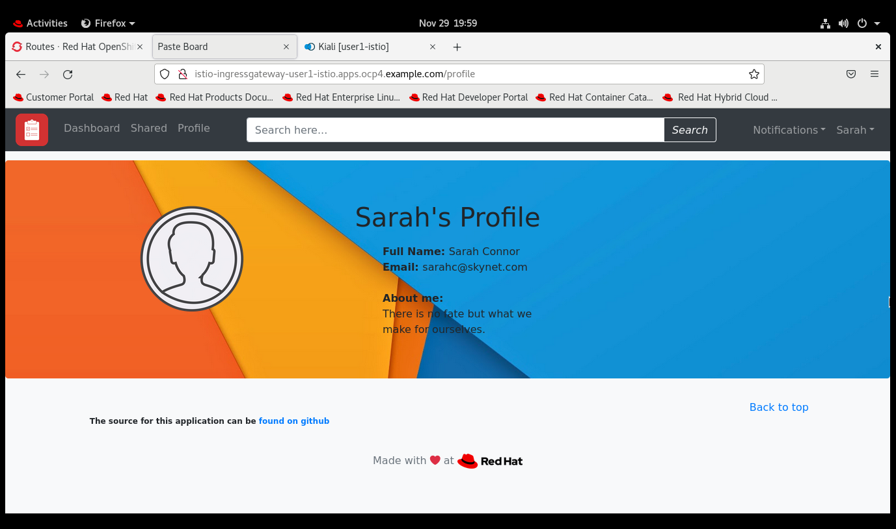  


### lab2.3 用 kiali 观测
删除 user1-istio 项目中 kiali 配置中被屏蔽的 DeploymentConfig 类型的负载, 并重启 kiali 实例  
```
oc get cm kiali -n user1-istio -o yaml | sed '/DeploymentConfig/d' | oc apply -n user1-istio -f -
configmap/kiali configured

oc rollout restart deployment kiali -n user1-istio
deployment.apps/kiali restarted
```

用脚本访问应用页面若干次, 使 kiali 采集到足够的数据.  
```
echo $GATEWAY_URL
http://istio-ingressgateway-user1-istio.apps.<your domain url>

for ((i=1;i<=100;i++)); do curl -s -o /dev/null $GATEWAY_URL; done
for ((i=1;i<=100;i++)); do curl -s -o /dev/null $GATEWAY_URL/profile; done
```

用浏览器访问 kiali, 观测应用...  
```
echo $(oc get route kiali -n user1-istio --template='https://{{.spec.host}}')
https://kiali-user1-istio.apps.<your domain url>
```

kiali 主界面显示了被观测的项目...  
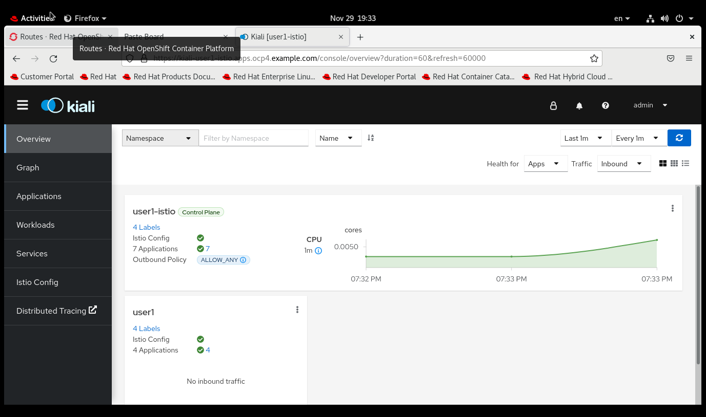  

并可以查看部署应用的调用链, 等...  
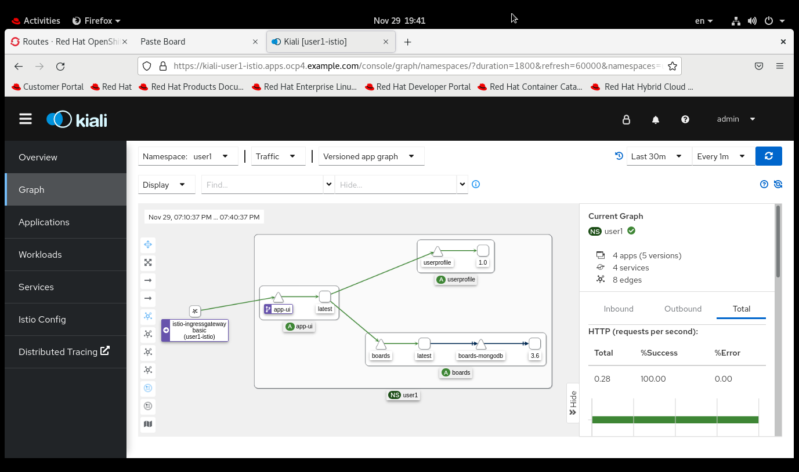  

注, kiali 新版本页面与参考文档的截图有所不同, 忽略...  


### lab3.1 部署 userprofile v2 服务
确认环境变量 有值, 部署 userprofile v2.0 服务...  
```
echo $USER_PROFILE_IMAGE_URI
<userprofile img url>

sed "s|%USER_PROFILE_IMAGE_URI%|$USER_PROFILE_IMAGE_URI|" ./config/app/userprofile-deploy-v2.yaml | oc create -f -
deployment.apps/userprofile-2 created

oc get pods -l deploymentconfig=userprofile
NAME                             READY   STATUS    RESTARTS   AGE
userprofile-2-8476499544-czmql   2/2     Running   0          2m45s
userprofile-5f57dcfccd-spsh7     2/2     Running   0          142m
```

然后通过浏览器访问应用. 此时的应用在 profile 标签页轮流切换 2 个版本的页面, v2 版本显示慢.  
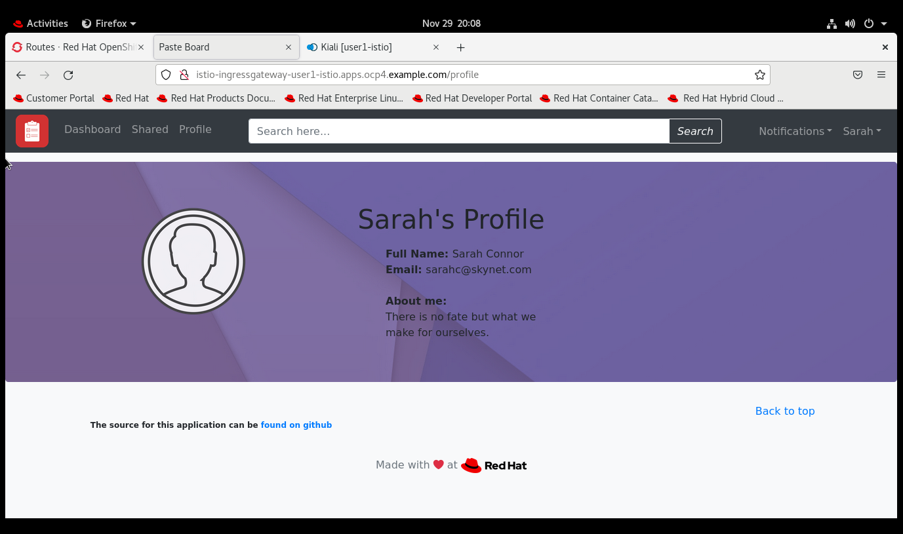  
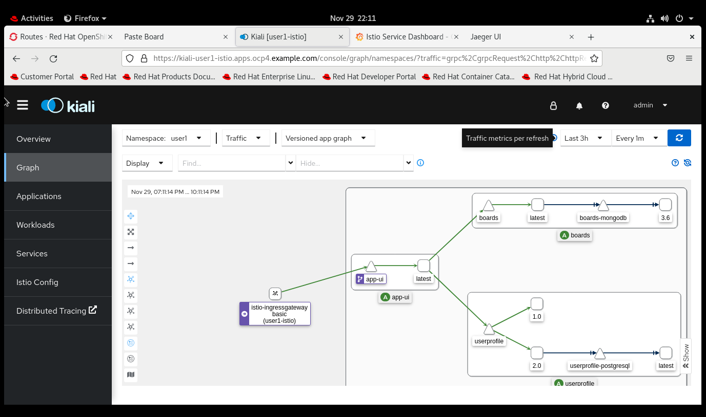  


### lab3.2 用 Grafana 观测
用浏览器访问 grafana, 观测应用...  
```
echo $(oc get route grafana -n user1-istio --template='https://{{.spec.host}}')
https://grafana-user1-istio.apps.<your domain url>
```
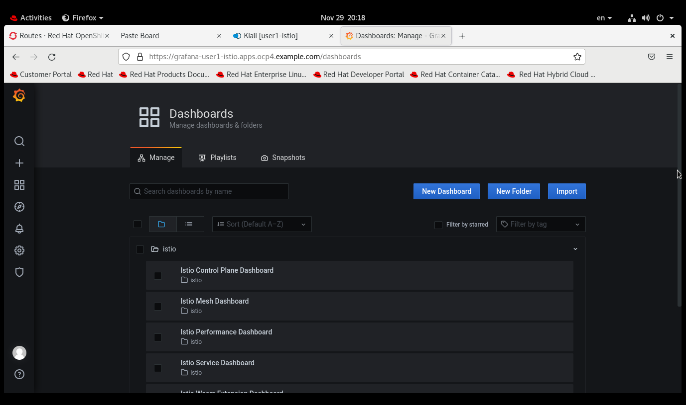  

用脚本访问 app-ui 应用页面若干次, 用 Istio Mesh Dashboard 进行观测...  
```
echo $GATEWAY_URL
http://istio-ingressgateway-user1-istio.apps.<your domain url>

while true; do curl -s -o /dev/null $GATEWAY_URL; done
```
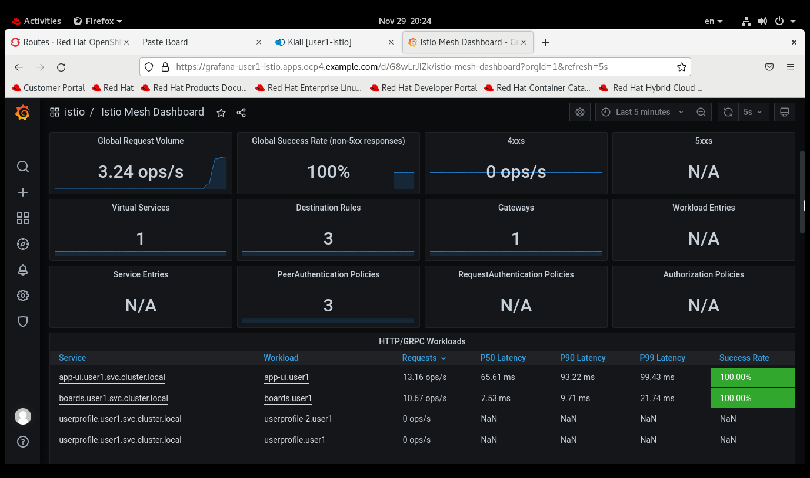  


用脚本访问 userprofile 应用页面若干次, 用 Istio Mesh Dashboard 进行观测...  
```
while true; do curl -s -o /dev/null $GATEWAY_URL/profile; done
```
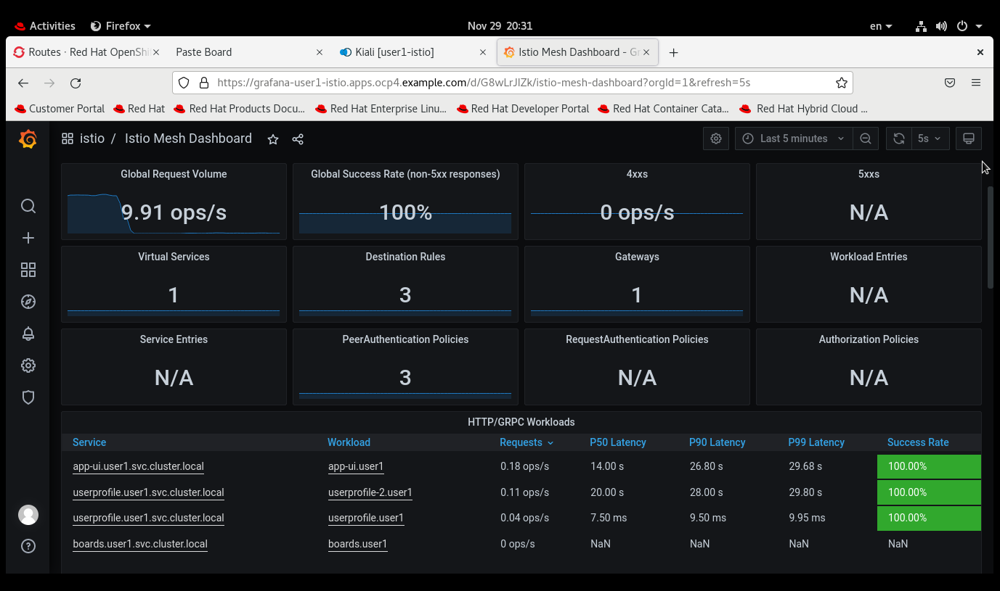  


持续访问, 换 Istio Service Dashboard 观测...  
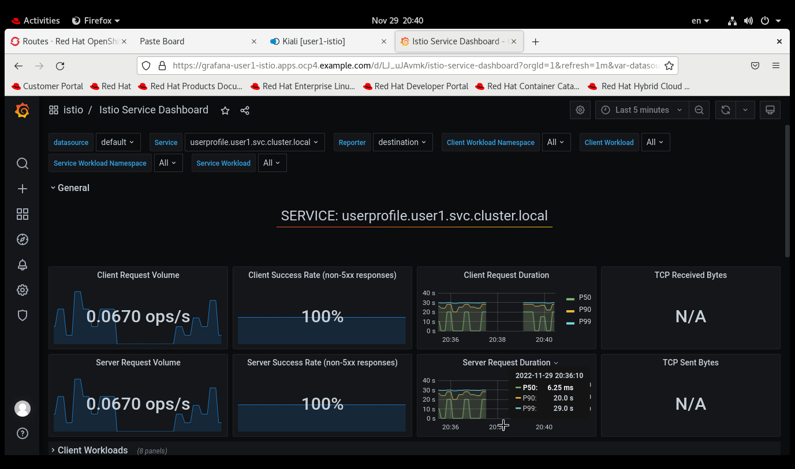  
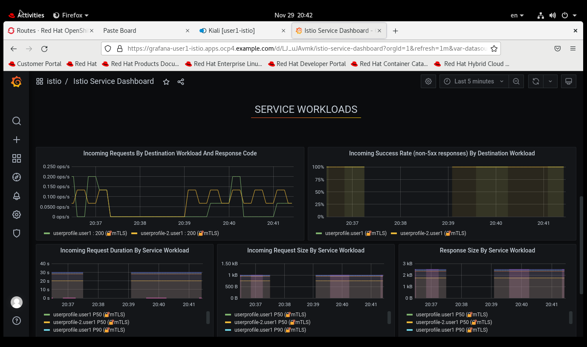  


### lab3.3 用 jaeger 观测
用浏览器访问 jaeger, 观测应用...  
```
echo $(oc get route jaeger -n user1-istio --template='https://{{.spec.host}}')
https://jaeger-user1-istio.apps.<your domain url>
```
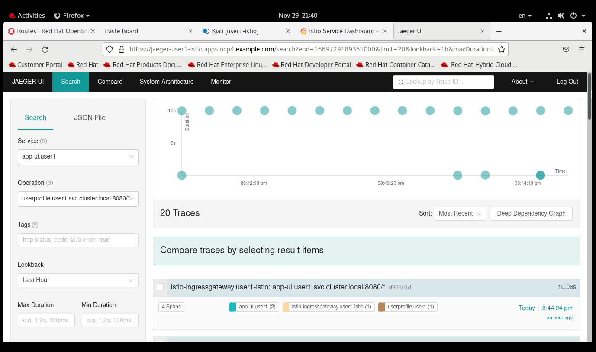  

发现有 10s 的响应时间的 pod ip=172.18.3.184  
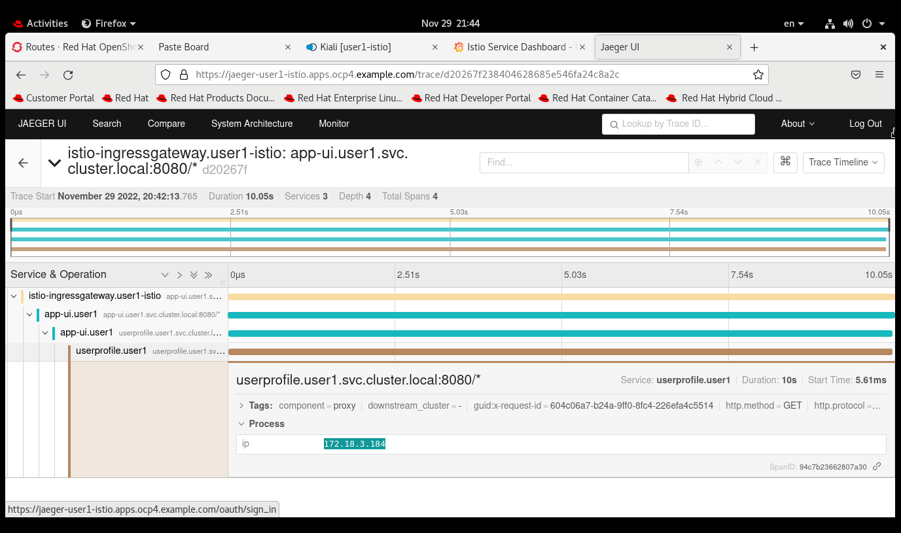  

确认 userprofile 慢应用是 v2 版本的 pod  
```
oc get pods -l deploymentconfig=userprofile,version=1.0 -o jsonpath='{.items[*].status.podIP}{"\n"}'
172.18.3.181

oc get pods -l deploymentconfig=userprofile,version=2.0 -o jsonpath='{.items[*].status.podIP}{"\n"}'
172.18.3.184
```


### lab4.1 应用不同版本的切换
新版本应用若有瑕疵, 需要快速回退, 因此要对应用不同版本的流量能够按需切换.  

在 DestinationRule 中定义应用的多个版本, 通过 VirtualService 指定访问 userprofile v2 版本...  
```
cat ./config/istio/destinationrules-all.yaml
...
spec:
  host: userprofile
  subsets:
  - name: v1
    labels:
      version: '1.0'
    trafficPolicy:
      loadBalancer:
        simple: ROUND_ROBIN        
  - name: v2
    labels:
      version: '2.0'
    trafficPolicy:
      loadBalancer:
        simple: RANDOM
  - name: v3
    labels:
      version: '3.0'
...

cat ./config/istio/virtual-services-all-v2.yaml
...
spec:
  hosts:
  - userprofile
  http:
  - route:
    - destination:
        host: userprofile
        subset: v2
...
```

创建 DestinationRule 和 VirtualService ...  
```
oc apply -f ./config/istio/destinationrules-all.yaml 
oc apply -f ./config/istio/virtual-services-all-v2.yaml

oc get dr
NAME                     HOST                     AGE
app-ui                   app-ui                   14s
boards                   boards                   14s
boards-mongodb           boards-mongodb           14s
userprofile              userprofile              14s
userprofile-postgresql   userprofile-postgresql   14s

oc get virtualservice
NAME                     GATEWAYS             HOSTS                        AGE
app-ui                                        ["app-ui"]                   32s
boards                                        ["boards"]                   32s
boards-mongodb                                ["boards-mongodb"]           32s
context-scraper                               ["context-scraper"]          32s
ingressgateway           ["ingressgateway"]   ["*"]                        8h
userprofile                                   ["userprofile"]              32s
userprofile-postgresql                        ["userprofile-postgresql"]   32s
```

访问页面, userprofile 页面切换到 v2 版本  
```
echo $GATEWAY_URL
http://istio-ingressgateway-user1-istio.apps.<your domain url>

for ((i=1;i<=5;i++)); do curl -s -o /dev/null $GATEWAY_URL/profile; done
for ((i=1;i<=100;i++)); do curl -s -o /dev/null $GATEWAY_URL; done
```
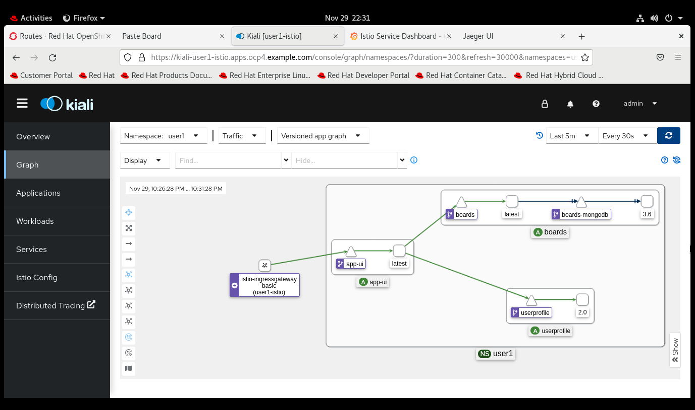  

通过 lab3 已知 userprofile v2 版本有性能问题, 切换回 v1 版本...  
```
cat ./config/istio/virtual-service-userprofile-v1.yaml
...
spec:
  hosts:
  - userprofile
  http:
  - route:
    - destination:
        host: userprofile
        subset: v1
...

oc apply -f ./config/istio/virtual-service-userprofile-v1.yaml
```

访问页面, userprofile 页面切换回 v1 版本  
```
echo $GATEWAY_URL
http://istio-ingressgateway-user1-istio.apps.<your domain url>

for ((i=1;i<=100;i++)); do curl -s -o /dev/null $GATEWAY_URL/profile; done
for ((i=1;i<=100;i++)); do curl -s -o /dev/null $GATEWAY_URL; done
```
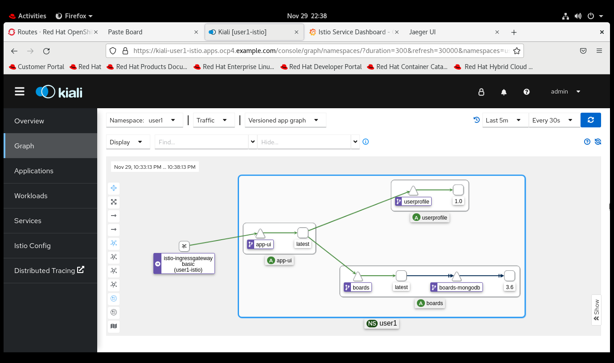  


### lab4.2 应用不同版本的流量控制
在 userprofile v3 版本中修复了 v2 版本的性能问题  
部署 userprofile v3 版本...  
```
echo $USER_PROFILE_IMAGE_URI
<userprofile img url>

sed "s|%USER_PROFILE_IMAGE_URI%|$USER_PROFILE_IMAGE_URI|" ./config/app/userprofile-deploy-v3.yaml | oc create -f -

oc get pods -l deploymentconfig=userprofile
NAME                             READY   STATUS    RESTARTS   AGE
userprofile-2-8476499544-czmql   2/2     Running   0          175m
userprofile-3-98b4498c-cqrw4     2/2     Running   0          45s
userprofile-5f57dcfccd-spsh7     2/2     Running   0          5h14m
```

新版本上线, 除了版本切换, 还可以通过 VirtualService 进行流量的精细控制, 例如, 90-10 分配  
```
cat ./config/istio/virtual-service-userprofile-90-10.yaml
...
spec:
  hosts:
  - userprofile
  http:
  - route:
    - destination:
        host: userprofile
        subset: v1
      weight: 90
    - destination:
        host: userprofile
        subset: v3
      weight: 10
...

oc apply -f ./config/istio/virtual-service-userprofile-90-10.yaml
```

用脚本访问应用页面若干次, 使 kiali 采集到足够的数据.  
```
echo $GATEWAY_URL
http://istio-ingressgateway-user1-istio.apps.<your domain url>

for ((i=1;i<=100;i++)); do curl -s -o /dev/null $GATEWAY_URL; done
for ((i=1;i<=100;i++)); do curl -s -o /dev/null $GATEWAY_URL/profile; done
```
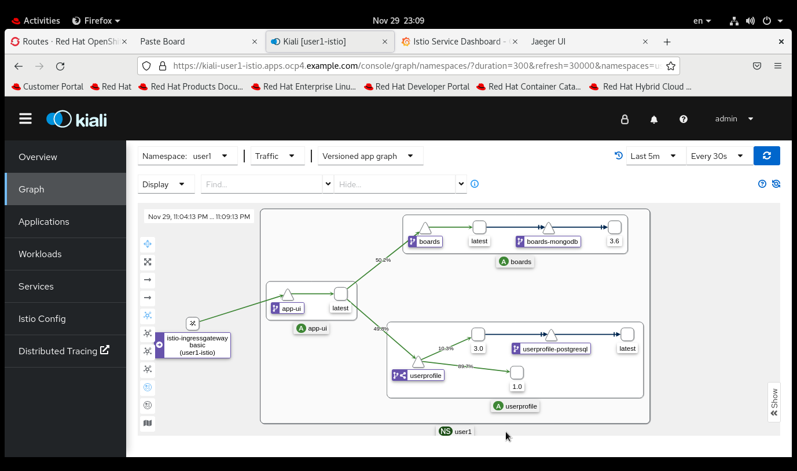  


若新版本在小流量运行正常, 可以通过 VirtualService 增加流量比例, 例如, 50-50 分配  
```
cat ./config/istio/virtual-service-userprofile-50-50.yaml
...
spec:
  hosts:
  - userprofile
  http:
  - route:
    - destination:
        host: userprofile
        subset: v1
      weight: 50
    - destination:
        host: userprofile
        subset: v3
      weight: 50
...

oc apply -f ./config/istio/virtual-service-userprofile-50-50.yaml
```
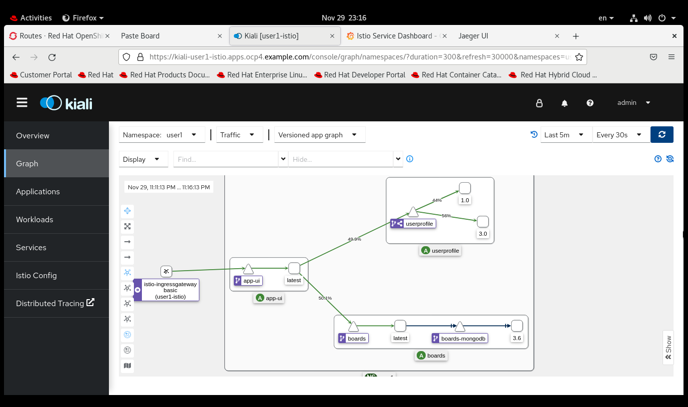  

直到对新版本放心, 将流量完全给新版本...  
```
cat ./config/istio/virtual-service-userprofile-v3.yaml
apiVersion: networking.istio.io/v1alpha3
kind: VirtualService
metadata:
  name: userprofile
spec:
  hosts:
  - userprofile
  http:
  - route:
    - destination:
        host: userprofile
        subset: v3

oc apply -f ./config/istio/virtual-service-userprofile-v3.yaml
```
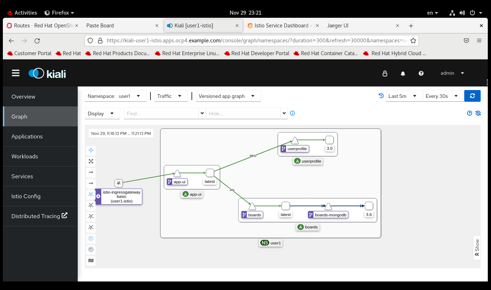  


### lab4.3 故障注入
当前的应用系统越来越复杂, 一个服务的故障, 可能引起一系列的负面反应, 最终可能导致整个应用系统的崩溃.  
为了提高应用系统的健壮性, 引入了[混沌工程](https://en.wikipedia.org/wiki/Chaos_engineering)的概念, 通过模拟各个服务出现的故障, 来检测整个应用系统在若干服务有故障时的情况.  

可以通过 VirtualService 模拟服务故障...  
```
cat ./config/istio/virtual-service-userprofile-503.yaml
...
  http:
  - fault:
      abort:
        httpStatus: 503
        percentage: 
          value: 50
    route:
    - destination:
        host: userprofile
        subset: v3
...

oc apply -f ./config/istio/virtual-service-userprofile-503.yaml
```
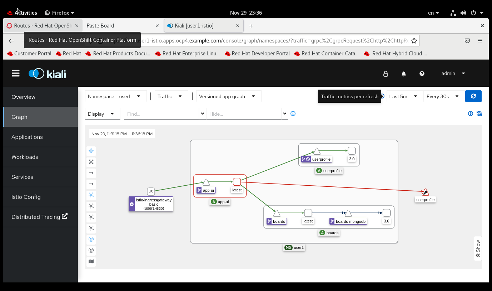  

或者通过 VirtualService 模拟性能问题...  
```
cat ./config/istio/virtual-service-userprofile-delay.yaml
...
  http:
  - fault:
      delay:
        fixedDelay: 5s
        percentage: 
          value: 50
    route:
    - destination:
        host: userprofile
        subset: v3
...

oc apply -f ./config/istio/virtual-service-userprofile-delay.yaml
```
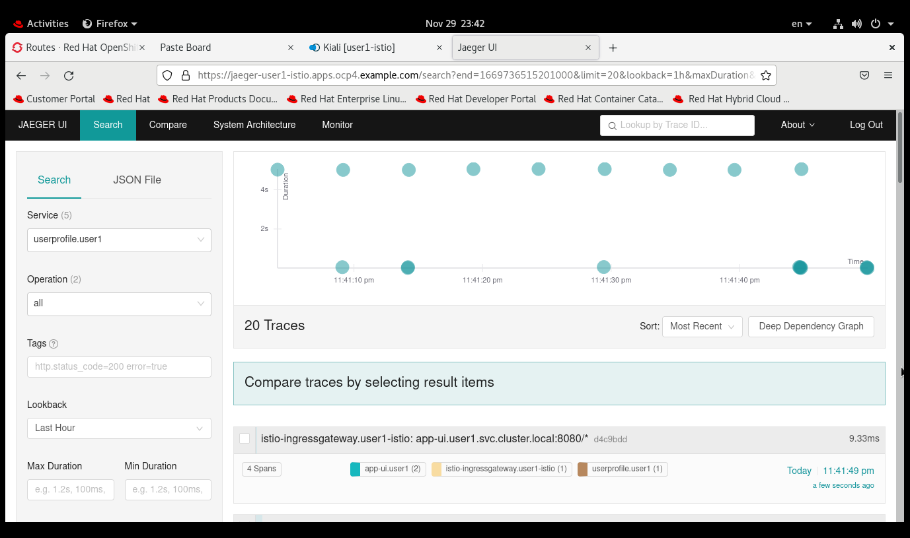  


### lab4.4 限流和融断机制
每个服务都有自己的设计容量, 访问量过大就可能出错, 甚至崩溃. 因此限流是必要的手段, 通过检测到服务出现异常来中断对该服务访问的机制就是融断. 融断是一种对过载的服务进行保护的机制, 一段时间后经过检测该服务恢复正常, 还需要恢复该服务的调用.  

通过 DestinationRule 实现限流和融断. 然后配置限流和融断, 实验中的配置是限流 1 个并发, 出错即融断 10 分钟  
只对 userprofile v3 版本服务配置了限流和融断, 请配置正确的 VirtualService 进行实验...  
```
oc apply -f ./config/istio/virtual-service-userprofile-50-50.yaml

cat ./config/istio/destinationrule-circuitbreaking.yaml
...
kind: DestinationRule
...
  - name: v3
    labels:
      version: '3.0'
    trafficPolicy:
      connectionPool:
        http:
          http1MaxPendingRequests: 1
          maxRequestsPerConnection: 1
      outlierDetection:
        consecutiveErrors: 1
        interval: 1s
        baseEjectionTime: 10m
        maxEjectionPercent: 100
...

oc apply -f ./config/istio/destinationrule-circuitbreaking.yaml
```

通过脚本访问服务, 期间 kill 掉 userprofile v3 的 pod 来模拟故障, 用 kiali 观测...  
```
echo $GATEWAY_URL
http://istio-ingressgateway-user1-istio.apps.<your domain url>

for ((i=1;i<=100;i++)); do curl -s -o /dev/null $GATEWAY_URL; done
while true; do curl -s -o /dev/null $GATEWAY_URL/profile; done
```

在另一个窗口执行 kill pod 操作, OpenShift 会自动恢复该 pod...  
```
USERPROFILE_POD=$(oc get pod -l deploymentconfig=userprofile,version=3.0 -o jsonpath='{.items[0].metadata.name}')

echo $USERPROFILE_POD
userprofile-3-98b4498c-cqrw4

oc exec $USERPROFILE_POD -- kill 1
```
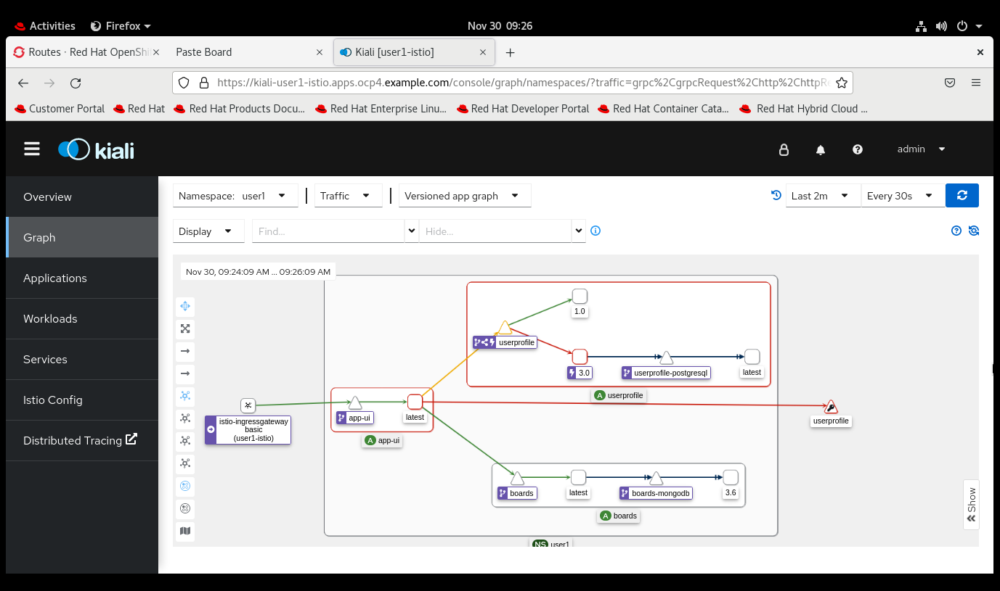  

完成此实验后, 将配置重置  
```
oc apply -f ./config/istio/destinationrules-all.yaml
oc apply -f ./config/istio/virtual-services-default.yaml
```

### lab5.1 启用服务间安全传输
安全是个永远的话题, 虽然 OpenShift 为容器的运行提供了相对安全的环境, 但应用服务本身的安全依然必要.  
应用服务之间的安全传输是其中之一.  

之前实验中没有配置安全传输, 因此, 可以从任何 user1 项目中的 pod 访问服务数据.  
例如, 用没有配置 Service Mesh 的 rhsso-operator 的 pod 可以访问到 boards 服务的数据...  
```
oc rsh rhsso-operator-5797798649-5qglq

curl http://boards.user1:8080/shareditems     
[
  {
    "_id": "6385c2ec229ae60018c6eb87",
    "type": "string",
    "raw": "Hello OpenShift!",
    "name": "",
    "id": "GMuTEXoO2",
    "created_at": "2022-11-29T08:29:32+00:00"
  }
]
```

Service Mesh 可以通过配置实现服务之间的安全传输, 而不需要应用修改代码.  
清除之前实验用的 DestinationRule, 启用 mTLS...  
```
oc delete dr --all

cat ./config/istio/peer-authentication-mtls.yaml
apiVersion: "security.istio.io/v1beta1"
kind: "PeerAuthentication"
metadata:
  name: "default"
spec:
  mtls:
    mode: STRICT

oc create -f ./config/istio/peer-authentication-mtls.yaml

cat ./config/istio/destinationrule-mtls.yaml
apiVersion: "networking.istio.io/v1alpha3"
kind: "DestinationRule"
metadata:
  name: "destinationrule-mtls-istio-mutual"
spec:
  host: "*.svc.cluster.local"
  trafficPolicy:
    tls:
      mode: ISTIO_MUTUAL

oc create -f ./config/istio/destinationrule-mtls.yaml
```

然后通过浏览器可以正常访问应用. 但用 rhsso-operator 的 pod 就不能访问到数据了.  
```
oc rsh rhsso-operator-5797798649-5qglq

curl http://boards.user1:8080/shareditems     
curl: (56) Recv failure: Connection reset by peer

curl -k https://boards.user1:8080/shareditems
curl: (16) SSL_write() returned SYSCALL, errno = 32
```


### lab5.2 用 kiali 监测安全传输
通过脚本访问服务, 在 kiali 中启用安全的配置, 进行观测...  
```
echo $GATEWAY_URL
http://istio-ingressgateway-user1-istio.apps.<your domain url>

for ((i=1;i<=100;i++)); do curl -s -o /dev/null $GATEWAY_URL; done
while true; do curl -s -o /dev/null $GATEWAY_URL/profile; done
```
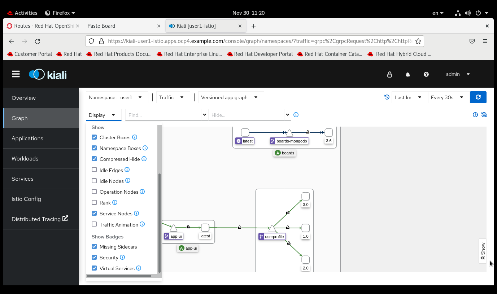  

完成此实验后, 将 mTLS 配置清除  
```
oc delete peerauthentication/default
oc delete dr --all
```


### lab5.3 单点登录环境准备
应用的登录验证也应用安全的重要组成部分. Service Mesh 可以通过集成 SSO 软件的方式帮助应用实现单点登录...  

离线环境下, RHSSO Operator 不能连接到数据库. 其中 external 模式 service 配置不正确, 而 internal 模式选用了过时的数据库镜像 registry.access.redhat.com/rhscl/postgresql-10-rhel7:1, 离线环境不能用. 忽略...  


### lab5.5 入口/出口的安全
入口和出口的安全解决了允许哪些外部服务访问本地服务和允许本地服务访问哪些外部服务的问题. Service Mesh 通过与 API 平台软件的集成, 可以对入口的访问进行精细化控制, 同时可以对出口进行管控.  

须要访问互联网. 忽略...  


